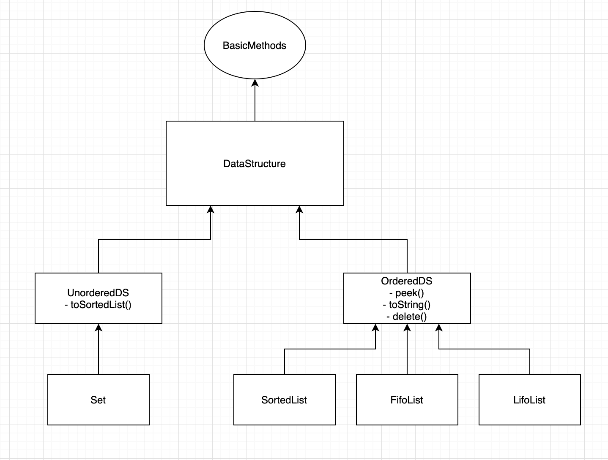

# PA 5: Inheritance

## Assignment Overview
**Due date: Tuesday, February 10 @ 11:59PM**

This assignment makes you familiar with the concept of inheritance.

This assignment will require you to build some data structures in an orderly fashion by extending classes and implementing interfaces.
You will also be expected to test your code extensively by writing your own test cases. Only 30%
of the total test cases will be provided in the gradescope and the rest 70% test cases are hidden. 
## Getting Started
There are a number of ways to get started on development. The following is the recommended way to ensure that your code will compile during grading.

1. If you are using your own machine or are on a lab computer to complete the assignment, go to step 2 directly. Otherwise, ssh into your cs8bwi20 account. 
    - `ssh cs8bwi20__@ieng6.ucsd.edu`
2. Acquire the starter files.
    - From ieng6: 
        - Log in to your cs8bwi20 account. 
        - From the command line, use the command `cp -r ~/../public/pa5 ~/` (this will copy the entire starter files directory to your home directory)
        - Type `ls ~` to verify that you have copied the `pa5` directory over. 
    - From GitHub: 
        - `git clone https://github.com/CaoAssignments/cse8b-wi20-pa5-interface-starter.git`
        - Alternatively, you can download the repo as a zipped folder.
3. If you downloaded the repo as a zipped folder, navigate to it through your terminal or text editor (Atom, Eclipse, etc.). If you git cloned the repo, you can switch into that directory immediately.
    - `cd cse8b-wi20-pa5-interface-starter`
    - Optional: You may choose to rename this repo. You can do this by using this command:
        - `mv cse8b-wi20-pa5-interface-starter pa5`
4. You can now start working on it through vim using the following command or open the directory in your preferred editor.
    - `vim FifoList.java` or `gvim FifoList.java`
5. To compile your code, use the `javac` command.
    - Syntax: `javac file1.java file2.java etc...`
    - Example: `javac FifoList.java`
6. To run your code, use the `java` command passing in the name of the class with the main method that you want to run.
    - Syntax: `java nameOfClass`
    - Example: `java FifoList`


## Introduction to Data Structures 

A data structure is a means of storing and organizing data that enables efficient access 
and modification. There are two types of data structures: 
- Ordered data structures
- Unordered data structures

Ordered data structures maintain an ordered collection of elements based on each data 
structure's underlying characteristics whereas unordered data structures have no order.

## Ordered Data Structures

### FifoList

FifoList is a data structure that maintains its elements in First-In-First-Out order (FIFO). 
FIFO means that an element is earlier in the data structure's order if it was added before 
other elements were added. This is described below:
```
Creating FifoList with 2, then 7, and then 4:
2, 7, 4

Add 5 to the FifoList:
2, 7, 4, 5

Peek operation (returns the top element):
Since FifoList maintains elements in FIFO order, the top element is 2. Hence, returns 2. 

Delete operation (deletes the top element):
7, 4, 5
```

### LifoList

LifoList is a data structure that maintains its elements in Last-in-First-out order (LIFO). 
LIFO means that an element is earlier in the data structure's order if it was added after 
other elements were added. This is
described below: 
```
Creating LifoList with 2, then 7, and then 4:
4, 7, 2

Add 5 to the LifoList:
5, 4, 7, 2

Peek operation (returns the top element):
Since LifoList maintains elements in LIFO, the top element is 5. Hence, returns 5. 

Delete operation (deletes the top element):
4, 7, 2
```

### SortedList

SortedList is a data structure that maintains its elements in ascending sorted order. This is described below:
```
Creating SortedList with 2, 7, 4:
2, 4, 7

Add 5 to the SortedList:
2, 4, 5, 7

Peek operation (returns the top element, which is the smallest element):
Since SortedList maintains elements in ascending order, the top element is 2. Hence, returns 2. 

Delete operation (deletes the top element, which is the smallest element):
4, 5, 7
```

## Unordered Data Structures

### Set

A Set is a data structure that can store elements not in any particular order, 
and no repeated values are stored. This is described below:
```
Creating Set with 2, then 2, then 4:
Since Set doesn't contain duplicate values, the Set just contains 2 and 4, not in 
any particular order.
2, 4 (or any permutation of that since order doesn't matter)

Add 5 to the set:
2, 4, 5 (or any permutation of that since order doesn't matter)

Add 4 to the set:
2, 4, 5 (or any permutation of that since order doesn't matter)
```

# Implementation



In this assignment, you will be required to build the hierarchy based on the diagram above. The structure of classes and 
interfaces is shown above. 

## Provided Files
_**DO NOT MODIFY THESE FILES.**_ We will use our own copy when grading, so any modifications you make will not be 
carried over.

### BasicMethods.java
This is an interface with following methods: `add`, `size`.
 
## Your Task: Implement all the following classes from scratch.

### DataStructure.java
This is an abstract class which is at the top-level of our design and implements the `BasicMethods` interface. However, none of the methods from the `BasicMethods` interface will be implemented in this class. Therefore, every class that extends this class should also implement the methods from the `BasicMethods` interface. Your class should contain the following 
`protected` class variables:
- int[] array;

You _**must**_ use this array to implement subsequent data structures.

### OrderedDS.java
This is an abstract class which extends the `DataStructure` class. This class should have _**public abstract**_
 methods named `peek` and `delete`, which should be implemented by every class that extends this class. The `peek` and 
`delete` methods don't take any parameters and return ints. These methods are discussed in detail
in further sections. The method signatures for these methods are as follows:
```
int peek();

int delete();
```
 
### UnorderedDS.java
This is an abstract class which extends the `DataStructure` class. This class should have a _**public abstract**_ 
method named `toSortedList`, which should be implemented by every class that extends it. The `toSortedList` 
method does't take any parameters and return a SortedList object. This method is discussed in detail 
in further sections. The method signature of this method is as follows:
 ```
SortedList toSortedList();
``` 

### FifoList.java
This class extends the `OrderedDS` class. Hence, this class has to implement all methods in the 
`OrderedDS` and `DataStructure` classes as well as the `BasicMethods` interface. This class
should contain the following `private` class variable:
- An integer `maxSize` that will hold the maximum size of integer array in your data structure.

You are free to declare any variables as per your convenience.

You need to also include the following two `private static final` strings in your class. 
These strings should be printed when FifoList is empty or FifoList reached its maximum size. 
- String `EMPTY_ERROR` = "FifoList is empty"
- String `MAX_SIZE_ERROR` = "FifoList maximum limit reached"   

This class should contain the following methods and you _**must**_ put the `@Override` keyword
above the methods that are inherited from parent classes:
#### - `public FifoList()`<br/>
The default constructor for the `FifoList` class, which will initialize maxSize to 0 and the int array
 to null. <br/>

#### - `public FifoList(int maxSize)`<br/>
The constructor for the `FifoList` class which takes the int input `maxSize` to initialize the size of the array.
You should _**NOT**_ reinitialize the array elsewhere. For example, creating an object as `new FifoList(5)` should create a FifoList whose maximum size is 5. 
If the parameters passed are invalid (negative numbers) then initialize your class variables `maxSize` to 0 
and the integer array to null. <br/>

#### - `public FifoList(FifoList q)`<br/>
The deep copy constructor for the `FifoList` class, which takes the FifoList object `q` as an input and 
creates a deep copy of the FifoList. <br/>

#### - `public void add(int element)`<br/>
A method to add an int `element` to the FifoList. If FifoList is already full or FifoList is null, print the contents of 
the `MAX_SIZE_ERROR` string and return. <br/>

#### - `public int delete()`<br/>
A method to delete the top element. Since elements in FifoList are maintained in FIFO order, 
this method should delete the first element that was inserted into the FifoList and return it. 
If FifoList is empty or FifoList is null, print the contents of `EMPTY_ERROR` and return -1. <br/>

#### - `public int peek()`<br/>
A method that returns the top element. Since elements in FifoList are maintained in FIFO order, 
this method should return the first element that was inserted into the FifoList. If FifoList is 
empty or FifoList is null, print the contents of `EMPTY_ERROR` and return -1.<br/>

#### - `public int size()`<br/>
A method that returns the size of the FifoList based on how many elements have been added.<br/>

#### - `public String toString()`<br/>
A method to print the FifoList as a string in the specified format. Since elements are stored in FIFO order, 
this method should return string where elements are in FIFO order. If FifoList is empty or FifoList is null,
this method should return an empty string.
For example: 
   ```
if the FifoList has elements 2,5,4 (in the order they are inserted), it should return: 
2-5-4
If 6 is added to the FifoList and if the toString() method is called, it should return: 
2-5-4-6
```
The above format is simply the string generated by joining all elements with `-` as the separator and
there is _**no**_ newline character at the end. 

### LifoList.java
This class extends the `OrderedDS` class. Hence, this has to implement all methods the in 
`OrderedDS` and `DataStructure` classes as well as the `BasicMethods` interface. This class
should contain the following `private` class variables:
- An int `maxSize` that will hold the maximum size of integer array in your data structure.

You are free to declare any variables as per your convenience.

You need to also include the following two `private static final` strings in your class. 
These strings should be printed when LifoList is empty or LifoList reached its maximum size. 
- String `EMPTY_ERROR` = "LifoList is empty"
- String `MAX_SIZE_ERROR` = "LifoList maximum limit reached"   

This class should contain the following methods and you _**must**_ put `@Override` keyword
above the methods that are inherited from parent classes:
#### - `public LifoList()`<br/>
The default constructor for `LifoList` class which will initialize your class variables maxSize to 0 and the int array
 to null.<br/>

#### - `public LifoList(int maxSize)`<br/>
The constructor for `LifoList` class which takes the int input `maxSize` to initialize the size of the array. 
You should _**NOT**_ reinitialize the array elsewhere. For example, creating an object as `new LifoList(5)` should create a LifoList whose maximum size is 5. 
If the parameters passed are invalid (negative numbers) then initialize your class variables `maxSize` to 0 
and the int array to null. <br/>

#### - `public LifoList(LifoList s)`<br/>
The deep copy constructor for `LifoList` class which takes the LifoList object `s` as an input and 
creates a deep copy of the LifoList. <br/>

#### - `public void add(int element)`<br/>
A method to add an int `element` to the LifoList. If LifoList is already full or LifoList is null, print the contents 
of `MAX_SIZE_ERROR` string and return. <br/>

#### - `public int delete()`<br/>
A method to delete the top element. Since elements in LifoList are maintained in LIFO order, 
this method should delete the latest element that was inserted into the LifoList and return it. 
If LifoList is empty or LifoList is null, print the contents of `EMPTY_ERROR` and return -1. <br/>

#### - `public int peek()`<br/>
A method that returns the top element. Since elements in LifoList are maintained in LIFO order, 
this method should return the latest element that was inserted into the LifoList. If LifoList is 
empty or LifoList is null, print the contents of `EMPTY_ERROR` and return -1.<br/>

#### - `public int size()`<br/>
A method that returns the size of the LifoList based on how many elements have been added.<br/>

#### - `public String toString()`<br/>
A method to print the LifoList as a string in the specified format. Since elements are stored in LIFO order,
  this method should return string where elements are in LIFO order. If LifoList is empty or LifoList is null, this method should return an empty string.
  For example:
   ```
if the LifoList has elements 2, 5, 4 (in the order they are inserted), it should return: 
4-5-2
If 6 is added to the LifoList and if toString() method is called, it should return: 
6-4-5-2
```
The above format is simply the string generated by joining all elements with `-` as the separator and
there is _**no**_ newline character at the end. 

### SortedList.java
This class extends the `OrderedDS` class. Hence, this has to implement all methods in the 
`OrderedDS` and `DataStructure` classes as well as the `BasicMethods` interface. Your class
should contain the following `private` class variables:
- An int `maxSize` that will hold the maximum size of int array in your data structure.

You are free to declare any variables as per your convenience.

You need to also include the following two `private static final` strings in your class. 
These strings should be printed when SortedList is empty or SortedList reached its maximum size. 
- String `EMPTY_ERROR` = "SortedList is empty"
- String `MAX_SIZE_ERROR` = "SortedList maximum limit reached"   

Your class should contain the following methods and you _**must**_ put `@Override` keyword
above the methods that are inherited from parent classes:
#### - `public SortedList()`<br/>
The default constructor for the `SortedList` class which will initialize your class variables maxSize to 0 and the int array
 to null.<br/>

#### - `public SortedList(int maxSize)`<br/>
The constructor for the `SortedList` class which takes the int input `maxSize` to initialize the size of the array. 
You should _**NOT**_ reinitialize the array elsewhere. For example, creating an object as `new SortedList(5)` should create a sortedList whose maximum size is 5. 
If the parameters passed are invalid (negative numbers) then initialize your class variables `maxSize` to 0 
and the int array to null. <br/>

#### - `public SortedList(SortedList s)`<br/>
The deep copy constructor for the `SortedList` class which takes the SortedList object `s` as an input and 
creates a deep copy of the SortedList.<br/>

#### - `public void add(int element)`<br/>
A method to add an int `element` to the SortedList. If SortedList is already full or SortedList is null, print the contents 
of `MAX_SIZE_ERROR` string and return. <br/>

#### - `public int delete()`<br/>
A method to delete the top element. Since elements in SortedList are maintained in ascending order, 
this method should delete the smallest element in the SortedList and return it. 
If SortedList is empty or SortedList is null, print the contents of `EMPTY_ERROR` and return -1. <br/>

#### - `public int peek()`<br/>
A method that returns the top element. Since elements in SortedList are maintained in ascending order, 
this method should return the smallest element in the SortedList. If SortedList is  empty or SortedList is null, print the contents
 of `EMPTY_ERROR` and return -1.<br/>

#### - `public int size()`<br/>
A method that returns the size of the SortedList based on how many elements have been added. <br/>

#### - `public String toString()`<br/>
A method to print the SortedList as a string in the specified format. Since elements are stored in ascending order,
  this method should return string where elements are in ascending order. If SortedList is empty or SortedList is null, this method should return an empty string.
  For example:
   ```
if the SortedList has elements 2, 5, 4(in the order they are inserted), it should return:
   2-4-5
If 3 is added to the SortedList and if toString() method is called, it should return:
2-3-4-5
```
The above format is simply the string generated by joining all elements with `-` as the separator and
there is _**no**_ newline character at the end. 

### Set.java
This class extends the `UnorderedDS` class. Hence, this has to implement all methods in the 
`UnorderedDS` and `DataStructure` classes as well as the `BasicMethods` interface. Your class
should contain the following `private` class variables:
- An int `maxSize` that will hold the maximum size of int array in your data structure.

You are free to declare any variables as per your convenience.

You need to also include the following two `private static final` strings in your class. 
These strings should be printed Set is empty or Set reached its maximum size. 
- String `DUPLICATE_ERROR` = "Element already exists"
- String `MAX_SIZE_ERROR` = "Set maximum limit reached"   

Your class should contain the following methods and you _**must**_ put `@Override` keyword
above the methods that are inherited from parent classes:
#### - `public Set()`<br/>
The default constructor for the `Set` class which will initialize your class variables maxSize to 0 and the int array
 to null.<br/>

#### - `public Set(int maxSize)`<br/>
The constructor for the `Set` class which takes the integer input `maxSize` to initialize the size of the array. 
You should _**NOT**_ reinitialize the array elsewhere. 
For example, creating an object as `new Set(5)` should create a Set whose maximum size is 5. 
If the parameters passed are invalid (negative numbers) then initialize your class variables `maxSize` to 0 
and the integer array to null. <br/>

#### - `public Set(Set s)`<br/>
The deep copy constructor for the `Set` class which takes the Set object `s` as an input and 
creates a deep copy of the Set. <br/>

#### - `public void add(int element)`<br/>
A method to add an integer `element` to the Set. Since duplicate elements are not allowed 
in Sets, you must check whether this element already exists in the Set. If the element 
already exists, print the contents of `DUPLICATE_ERROR` and return. If Set is already full or Set is null,
 print the contents of `MAX_SIZE_ERROR` string and return. <br/>

#### - `public int size()`<br/>
A method that returns the size of the Set based on how many elements have been added.<br/>

#### - `public String toSortedList()`<br/>
This method should convert the Set to SortedList and return the SortedList object.

## Testing
The starter code for testing `SortedList` is provided in `DataStructureTester.java`. You will be expected to code the 
test cases for all other data structures by yourselves. You do not have to upload this file on 
Gradescope when turning in your work. Four test cases, one for each data structure are described below: 

### Test - SortedList
```
Initialize a sortedList of size 5.
Add 7
Add 9
Add 2
Add 6
Add 3
Add 5 - This should print "SortedList maximum limit reached."
Delete() - This should return 2
Delete() - This should return 3
Peek() - This should return 6
toString() - This should return "6-7-9"
size() - This should return 3
```

### Test - FifoList
```
Initialize a FifoList of size 5.
Add 7
Add 9
Add 2
Add 6
Add 3
Add 5 - This should print "FifoList maximum limit reached."
Delete() - This should return 7
Delete() - This should return 9
Peek() - This should return 2
toString() - This should return "2-6-3"
size() - This should return 3
```

### Test - LifoList
```
Initialize a LifoList of size 5.
Add 7
Add 9
Add 2
Add 6
Add 3
Add 5 - This should print "LifoList maximum limit reached."
Delete() - This should return 3
Delete() - This should return 6
Peek() - This should return 2
toString() - This should return "2-9-7"
size() - This should return 3
```

### Test - Set
```
Initialize a Set of size 5.
Add 13
Add 6
Add 3
Add 3 - This should print "Element already exists"
Add 3 - This should print "Element already exists"
Add 7
Add 9
Add 19 - This should print "Set maximum limit reached"
Add 4 - This should print "Set maximum limit reached"
toSortedList() - This should return a sortedList object, let's say "p".
p.toString() - This should return "3-6-7-9-13"
size() - 5
```

**IMPORTANT: These 4 test cases above will be the only ones visible to you on Gradescope when submitting. Therefore, 
please test your code extensively to maximize your grade.**

## Student Satisfaction Survey

Please fill out our [student satisfaction survey](https://docs.google.com/forms/d/1yYE1gn2M661sf9I0mzr9Vx5DHYJ77Wtvhr7fx-Ex0cg/edit). We are changing how we approach giving assignments and would like to hear about your experiences. After filling out the survey, please write the following sentence at the top of your `README.md` file: **I have completed the student satisfaction survey.** 

## Style
**Make sure you follow the below guidelines for styling since we will be grading you on it.**

We will grade your code style thoroughly. Namely, there are a few things you must have in each file / class / method:

1. File header
2. Class header
3. Method header(s)
4. Inline comments
5. Proper indentation
6. Descriptive variable names
7. No magic numbers
8. Reasonably short methods (if you have implemented each method according to specification in this write-up, you’re fine). This is not enforced as strictly.
9. Lines shorter than 80 characters (keep in mind each tab is equivalent to 8 spaces).
10. Javadoc conventions (@param, @return tags, /** comments */, etc.)

A full [style guideline](https://sites.google.com/eng.ucsd.edu/cse8b-winter2020/style-guide?authuser=0) can be found here. If you need any clarifications, feel free to ask on Piazza.

## Submission
Required Submission Files
- `DataStructure.java`
- `OrderedDS.java`
- `UnorderedDS.java`
- `SortedList.java`
- `FifoList.java`
- `Set.java`
- `LifoList.java`

*Good Luck!*
